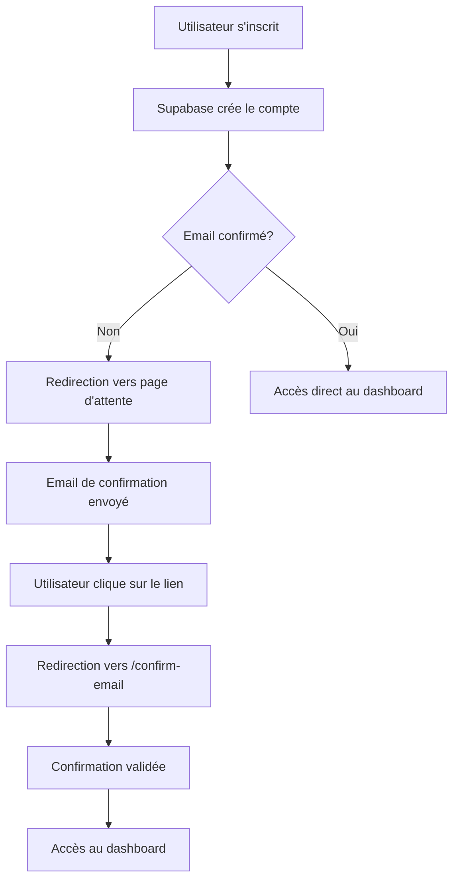

# 📧 Guide du Système de Confirmation d'Email - Forex Pricers

## 🎉 Système de Confirmation d'Email Implémenté

Votre application Forex Pricers dispose maintenant d'un système complet de confirmation d'email pour sécuriser l'inscription des utilisateurs.

## ✅ Fonctionnalités Implémentées

### 1. **Inscription avec Confirmation d'Email**
- ✅ **Email de confirmation automatique** envoyé lors de l'inscription
- ✅ **Redirection vers page d'attente** si confirmation requise
- ✅ **Vérification du statut** de confirmation d'email
- ✅ **Gestion des erreurs** et messages informatifs

### 2. **Pages de Confirmation**
- ✅ **`/confirm-email`** - Page de confirmation d'email
- ✅ **`/email-confirmation-pending`** - Page d'attente de confirmation
- ✅ **Interface utilisateur** claire et informative
- ✅ **Bouton de renvoi** d'email de confirmation

### 3. **Sécurité et Validation**
- ✅ **Vérification obligatoire** avant accès à l'application
- ✅ **Protection des routes** - accès refusé sans confirmation
- ✅ **Gestion des sessions** - déconnexion si email non confirmé
- ✅ **Renvoi d'email** sécurisé

## 🔧 Flux de Confirmation d'Email

### **1. Inscription Utilisateur**



### **2. Processus de Confirmation**

1. **Inscription** : L'utilisateur remplit le formulaire d'inscription
2. **Création du compte** : Supabase crée le compte avec `email_confirmed_at = null`
3. **Email envoyé** : Un email de confirmation est automatiquement envoyé
4. **Page d'attente** : L'utilisateur est redirigé vers `/email-confirmation-pending`
5. **Clic sur le lien** : L'utilisateur clique sur le lien dans l'email
6. **Confirmation** : Redirection vers `/confirm-email` avec validation
7. **Accès autorisé** : L'utilisateur peut maintenant se connecter

## 🎯 Pages et Fonctionnalités

### **Page d'Attente de Confirmation** (`/email-confirmation-pending`)

**Fonctionnalités :**
- ✅ **Affichage de l'email** de destination
- ✅ **Instructions claires** pour l'utilisateur
- ✅ **Bouton de renvoi** d'email de confirmation
- ✅ **Lien vers la connexion** si déjà confirmé
- ✅ **Design cohérent** avec le reste de l'application

**Interface :**
```typescript
// État d'attente
<Alert className="border-blue-500/50 bg-blue-500/10">
  <Mail className="h-4 w-4" />
  <AlertDescription>
    Email sent to: {email}
    Please check your inbox and click the confirmation link.
  </AlertDescription>
</Alert>
```

### **Page de Confirmation** (`/confirm-email`)

**Fonctionnalités :**
- ✅ **Vérification automatique** du statut de confirmation
- ✅ **Affichage du statut** (confirmé ou en attente)
- ✅ **Redirection automatique** vers le dashboard si confirmé
- ✅ **Bouton de renvoi** si non confirmé
- ✅ **Gestion d'erreur** robuste

**États :**
- **Email confirmé** : Message de succès + redirection
- **Email non confirmé** : Formulaire de renvoi d'email
- **Erreur** : Message d'erreur avec options de récupération

## 🔒 Sécurité et Validation

### **Vérification Obligatoire**

**Dans la connexion :**
```typescript
// Vérification avant accès
const { confirmed } = await checkEmailConfirmation();

if (!confirmed) {
  setError('Please confirm your email address before logging in.');
  return;
}
```

**Dans les routes protégées :**
- ✅ **ProtectedRoute** vérifie l'authentification
- ✅ **Vérification supplémentaire** de la confirmation d'email
- ✅ **Redirection** vers la page de confirmation si nécessaire

### **Gestion des Sessions**

**Nettoyage automatique :**
- ✅ **Déconnexion** si email non confirmé
- ✅ **Suppression des données** utilisateur non confirmées
- ✅ **Redirection** vers la page de confirmation

## 🚀 Configuration Supabase

### **Paramètres d'Email**

**Dans AuthService :**
```typescript
const { data: authData, error } = await supabase.auth.signUp({
  email: data.email,
  password: data.password,
  options: {
    emailRedirectTo: `${window.location.origin}/confirm-email`,
    data: {
      // Métadonnées utilisateur
    }
  }
})
```

### **URL de Redirection**

- ✅ **URL de base** : `window.location.origin`
- ✅ **Route de confirmation** : `/confirm-email`
- ✅ **URL complète** : `https://votre-domaine.com/confirm-email`

## 📱 Interface Utilisateur

### **Design Cohérent**

**Thème :**
- ✅ **Gradient de fond** : `from-slate-900 via-blue-900 to-slate-900`
- ✅ **Cartes transparentes** : `bg-white/10 backdrop-blur-md`
- ✅ **Icônes colorées** : Orange pour l'attente, vert pour la confirmation
- ✅ **Boutons cohérents** : Style identique au reste de l'application

**Responsive :**
- ✅ **Mobile-friendly** : Interface adaptée aux petits écrans
- ✅ **Navigation claire** : Liens vers les autres pages
- ✅ **Accessibilité** : Contraste et lisibilité optimisés

## 🧪 Test du Système

### **Étapes de Test**

1. **Inscription** :
   - Allez sur `/signup`
   - Remplissez le formulaire avec un email valide
   - Cliquez sur "Create Account"

2. **Vérification de la redirection** :
   - Vous devriez être redirigé vers `/email-confirmation-pending`
   - Vérifiez que votre email s'affiche correctement

3. **Email de confirmation** :
   - Vérifiez votre boîte email
   - Cliquez sur le lien de confirmation

4. **Confirmation** :
   - Vous devriez être redirigé vers `/confirm-email`
   - Vérifiez que la confirmation est validée

5. **Connexion** :
   - Allez sur `/login`
   - Connectez-vous avec vos identifiants
   - Vous devriez accéder au dashboard

### **Scénarios de Test**

**Test 1 : Inscription normale**
- ✅ Inscription → Email envoyé → Confirmation → Accès

**Test 2 : Renvoi d'email**
- ✅ Page d'attente → Bouton "Resend" → Nouvel email envoyé

**Test 3 : Connexion sans confirmation**
- ✅ Tentative de connexion → Message d'erreur → Redirection

**Test 4 : Confirmation après connexion**
- ✅ Connexion → Vérification → Accès autorisé

## 🔧 Fonctions Techniques

### **AuthService**

```typescript
// Vérification de la confirmation
public async checkEmailConfirmation(): Promise<{ confirmed: boolean; error: string | null }>

// Renvoi d'email de confirmation
public async resendConfirmationEmail(email: string): Promise<{ error: string | null }>

// Inscription avec gestion de confirmation
public async signUp(data: SignupData): Promise<{ user: User | null; error: string | null; needsConfirmation: boolean }>
```

### **useAuth Hook**

```typescript
// Nouvelles fonctions disponibles
const { 
  checkEmailConfirmation,
  resendConfirmationEmail,
  signUp // Retourne needsConfirmation
} = useAuth()
```

## 🎉 Résultat Final

**Le système de confirmation d'email est maintenant opérationnel !**

- ✅ **Sécurité renforcée** - Confirmation obligatoire
- ✅ **Interface utilisateur** claire et intuitive
- ✅ **Gestion d'erreur** robuste
- ✅ **Intégration Supabase** complète
- ✅ **Flux utilisateur** fluide et sécurisé

---

**🎊 Félicitations !** Votre application dispose maintenant d'un système de confirmation d'email professionnel et sécurisé. Les utilisateurs doivent confirmer leur email avant d'accéder à l'application, garantissant ainsi la sécurité et la validité des comptes.
